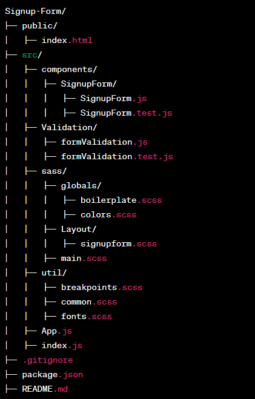

# Sign up form React App

An HTML sign-up form is a webpage that permits clients of a pet store owner to register for the newsletter.

## Used technologies

The requirement for this project is to have Node JS, NPM , and React installed on your local machine.

### Installation

- Node JS
- NPM
- React js

## Steps to Start the App

1. Clone or download the repository from GitHub: https://github.com/AleksandarKostadinov/sign_up

2. Install project Dependencies ( package.json)

Run the following commands

```sh
npm i
```

3. After the installation is complete, start the development server by running the following command:

```sh
npm run start
```

The project should now be running locally on your machine. Open a web browser and visit http://localhost:3000 to view the application.

## How to TEST

Run the following command to :

```sh
npm run test
```

## Design system

for the styling and choosing the classNames , BEM (Block Element Modifier) naming convention is used for this project

## Project folder structer

the project is well-structured for efficiency and organization:

In the "public" folder, we have the "index.html" file for user browsers.

Within the "src" folder:

"components" house our website components.
"validation" stores validation-related files.
"sass" manages our styling.
In the "sass" folder:

"globals" holds color variables and key styles.
"layout" stores component-specific styling.
"util" contains common styles, fonts, and responsive breakpoints.
We consolidate our styles in "main.scss," which is imported in "App.js" for a unified design approach.


